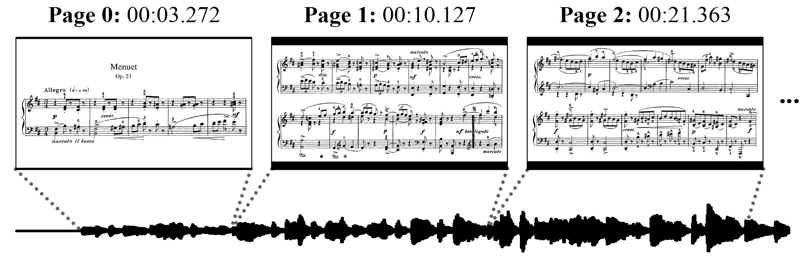
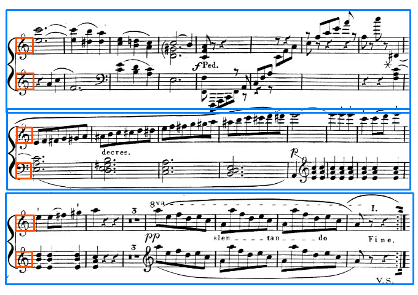

# YouTube Score Video Dataset

This is the official dataset repository for `YouTube Score Video Dataset` from following paper
> U-MusT: A Unified Framework for Cross-modal Translation of Score Images, Symbolic Music, and Performance Audio
> [https://ieeexplore.ieee.org/document/11316398](https://ieeexplore.ieee.org/document/11316398)

This repository contains:
1. Metadata of score-following videos from YouTube in csv format
2. Scripts related to slide segmentation
3. Scripts related to system croping and resizing


## Overview

### Metadata
The metata list `ytsv_metadata.csv` contains metadata of 12,317 score-following videos from YouTube.
The list of informations metadata list have as follows:

| Field | Description | Example Value |
|-------|-------|-------|
| YT Id | Unique YouTube video identifier | `0oRyPLnPeFw` |
| Title of Video | Original video title as displayed on YouTube |	`Walton - Passacaglia (1982) for solo cello [w/score]` |
| User | User or channel name who uploaded the video | `AdamMusicWorld` |
| Duration | Video length in MM:SS format | `10:06` |
| **Composer Full Name** | Complete name of the composer | `William Walton` |
| **Title of Piece** | Name of the musical composition | `Passacaglia` |
| **Opus Number** | Catalog number of the composition (null if unavailable) | `null` |
| **Instrumentation** | Categorization of musical forces from predefined set: {orchestral, concerto, solo, duet, trio, quartet, quintet, larger chamber music, choral, wind band, non-classical, vocal, unknown} | `solo` |
| **Category** | Specific genre or form description | `cello solo` |
| **Piano Included** | Boolean indicating presence of piano part | `False` |
| **String Included** | Boolean indicating presence of string instruments | `True` |
| **Wind Included** | Boolean indicating presence of wind instruments | `False` |
| **Voice Included** | Boolean indicating presence of vocal parts	| `False` |
| **Year** | Year of composition | `1982` |
| **Staff Count** | Two numbers indicating single-melody instrument staves and piano staves, separated by hyphen | `1-0` |

**Bolded fields** are information obtained by providing video title to Claude-3.5-Sonnet (`claude-3-5-sonnet-20241022`) model. The model receives a prompt containing the video ID and title, along with an example of the expected output format. It then analyzes the title to extract and structure this information, maintaining consistency with predefined categories and formats.

The Staff Count field deserves particular attention as it provides crucial information about score complexity. The
format “X-Y” represents X single-melody instrument staves and Y piano staves. For example, “1-0” indicates one melodic
staff with no piano staves, while “0-2” would indicate a piano- only piece with the typical grandstaff(two-staff) layout.

| Category | Description | Videos | Segments | Duration (hrs) |
| ------- | ------- | ------- | ------- | ------- | 
| Piano Solo | Solo piano compositions | 9,052 | 232,029 | 762.34 |
| Accompanied Solo | Solo compositions for a non-piano instrument with piano accompaniment | 912 | 47,373 | 141.83 |
| String Quartet | Compositions for two violins, viola, and cello | 594 | 48,470 | 138.48 |
| Others Compositions | not classified under predefined categories | 454 | 24,912 | 69.13 |
| Unaccompanied Solo | Solo compositions for a single non-piano instrument | 207 | 3,542 | 11.24 |
| Guitar Solo | Solo compositions for classical guitar | 192 | 1,976 | 6.97 |
| Piano Trio | Compositions for piano, violin, and cello | 254 | 22,736 | 68.51 |
| Organ Solo | Solo compositions for organ | 161 | 5,923 | 20.01 |
| Piano Quintet | Compositions for piano and string quartet | 109 | 13,382 | 34.69 |
| Piano Quartet | Compositions for piano, violin, viola, and cello | 84 | 9,168 | 26.07 |
| Harpsichord Solo | Solo compositions for harpsichord | 84 | 17,419 | 43.93 |
| Woodwind Ensemble | Ensembles consisting only of woodwind instruments | 63 | 3,784 | 10.05 |
| Other Wind Ensemble | All kinds of wind ensembles beyond the woodwind family | 51 | 3,206 | 8.06 |

The aggregated results of the categories from extracted metadata are shown in table above. The category “Accompanied Solo” includes solo compositions for a single instrument with piano accompaniment. In contrast, the “Unaccompanied Solo” category refers to solo compositions for a single instrument without any piano accompaniment. The category “Other Wind Ensemble” includes all wind ensembles that are not exclusively composed of woodwind instruments, while “Woodwind Ensemble” consists exclusively of woodwind instruments. Compositions that do not belong to any of the predefined categories have been grouped under “Others”.

For more information, please check [A.A and A.B of U-MusT's Supplementary Material.](https://ieeexplore.ieee.org/ielx8/10723155/10818373/11316398/supp1-3648794.pdf?arnumber=11316398)


### Slide Segmentation


We devise a system for identifying the timing points of slide transitions in the collected score-following videos. The transitions manifest in two distinct ways: instantaneous cuts between pages, and animated transitions such as crossfades or wipes. To handle this, we develop a rule-based segmentation algorithm that accommodates both cases while maintaining temporal accuracy. This process extracts the individual slides of score images along with their corresponding audio slices, creating the foundational paired segments for the dataset. Details are elaborated in [A.C of U-MusT's Supplementary Material.](https://ieeexplore.ieee.org/ielx8/10723155/10818373/11316398/supp1-3648794.pdf?arnumber=11316398)


### System Croping and Resizing


The collected videos often feature letterboxes or pillarboxes, diverse aspect ratios, and inconsistent margins around contents; also, each slide contains an arbitrary number of musical systems alongside non-musical elements such as titles. To handle these irregularities, each musical system in a slide must be cropped and resized in a consistent format. Therefore, we label new annotations to fine-tune [YOLOv8](https://docs.ultralytics.com/models/yolov8)-based models for two different tasks: system-wise bounding box regression (boxes with blue borders), and staff height detection (average value of heights of read boxes), as depicted above. We use the models to produce regularized crops of each system, a process which we discuss further in [A.D of U-MusT's Supplementary Material.](https://ieeexplore.ieee.org/ielx8/10723155/10818373/11316398/supp1-3648794.pdf?arnumber=11316398)


## HOW TO USE
### Prepare Video Files
Before running the code, please make sure you download all the videos from the metadata list `metadata/ytsv_metadata.csv` using your preferred method.  
After downloading the videos, please organize them in a directory structure as follows:

```
<ANY DIR NAME YOU LIKE>/
├── mp4/
│   ├── <yt_id>.mp4
│   ├── ...
```

Where `<yt_id>` corresponds to the YouTube video IDs listed in the metadata CSV file.

### Run the Code
Run the `run.sh` script after modifying the `DATSET_DIR` variable to point to the directory containing the `mp4/` folder with downloaded videos.


## Installation

```bash
# Clone the repository
git clone git@github.com:MALerLab/youtube-score-video-dataset.git
cd youtube-score-video-dataset

# Install dependencies
pipenv --python 3.10.12
pipenv sync
```

## Project Structure

```
youtube-score-video-dataset/
├── ytsv/                            # Main package
│   ├── __init__.py                  # Main module
│   ├── system_utils.py              # System detection and cropping utilities
│   ├── slide_utils.py               # Slide segmentation utilities
│   ├── utils.py                     # Helper functions
├── metadata/                        # Metadata files
│   └── ytsv_metadata.csv            # YouTube Score Video Dataset metadata
├── checkpoints/                     # Model checkpoints for YOLOv8
├── figures/                         # Figures for README and documentation
├── README.md                        
├── Pipfile                          # Pipenv configuration file
├── Pipfile.lock                     # Pipenv lock file
└── ...                              # Other files
``` 


## TODO
- [ ] add error logging
- [ ] try-except blocks for main functions
- [ ] add segmentation process based on the original file names


## Acknowledgements
If you publish material based on the YouTube Score Video Dataset, we request you to include a reference to paper **[1]** in your bibliography.

## References
**[1]** Jongmin Jung, Dongmin Kim, Sihun Lee, Seola Cho, Hyungjoon So, Irmak Bukey, Chris Donahue, and Dasaem Jeong. "U-MusT: A Unified Framework for Cross-modal Translation of Score Images, Symbolic Music, and Performance Audio". IEEE Transactions on Audio, Speech and Language Processing. p1-16. 2025. https://doi.org/10.1109/TASLPRO.2025.3648794

## License
Source code in this repository is available under the MIT license.