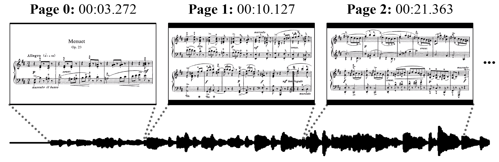
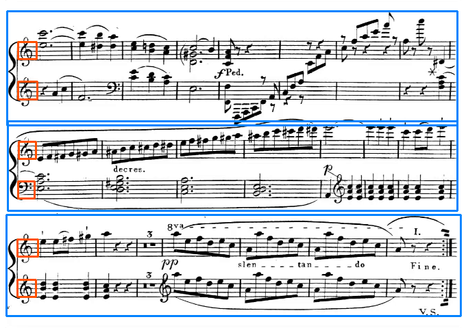

# YouTube Score Video Dataset

[](https://doi.org/10.1109/TASLPRO.2025.3648794)
[](https://ieeexplore.ieee.org/document/11316398)
[](https://sakem.in/u-must/)

Official dataset repository for
> **U-MusT: A Unified Framework for Cross-Modal Translation of Score Images, Symbolic Music, and Performance Audio**<br>
> Jongmin Jung\*, Dongmin Kim\*, Sihun Lee, Seola Cho, Hyungjoon Soh, Irmak Bukey, Chris Donahue, and Dasaem Jeong (\*equal contribution)<br>
> *IEEE Transactions on Audio, Speech and Language Processing, vol. 34, 2026*

**YTSV** is a corpus of score-following videos — recordings paired with the scrolling sheet music they perform — mined from YouTube and segmented into aligned score-image and audio pairs. At **1,341 hours** it is an order of magnitude larger than any prior music modal-translation dataset, and it is what makes the unified tokenization approach in U-MusT viable. This repository publishes the **metadata** and the **preprocessing pipeline**; the videos themselves are not redistributed, and the model code lives in [MALerLab/U-MusT](https://github.com/MALerLab/U-MusT).

## What's in this release

| Component | What it is | Location |
|---|---|---|
| Metadata | 12,317 score-following videos, 15 annotated fields each | `metadata/ytsv_metadata.csv` |
| Slide segmentation | Rule-based detection of page transitions | `ytsv/slide_utils.py` |
| System cropping | YOLOv8 system detection and staff-height normalization | `ytsv/system_utils.py` |
| Pipeline entry point | Runs segmentation and cropping over your videos | `run.sh`, `ytsv/__main__.py` |
| YOLO detectors | System and staff-height models | [MALerLab/ls-yolo releases](https://github.com/MALerLab/ls-yolo/releases) |
| Video files | — | **not redistributed** — download them yourself |
| Tokenized data | Pre-computed image and audio tokens | [Hugging Face](#pre-tokenized-data) |

## Dataset at a glance

- **12,317 score-following videos** are annotated in the metadata. After filtering to segments under 20 seconds of audio and under 256,000 pixels of image, **12,217 videos yield 433,920 image–audio pairs totalling 1,341 hours** — these are the figures reported in the paper.
- Roughly **10,000 unique pieces by more than 2,000 composers**.
- Piano Solo dominates at 9,052 videos and 762 hours; the piano subset (**YTSV-P**) used to train the released Image-to-Audio model is 252k segments and 815 hours.

| Category | Description | Videos | Segments | Duration (hrs) |
| ------- | ------- | ------- | ------- | ------- | 
| Piano Solo | Solo piano compositions | 9,052 | 232,029 | 762.34 |
| Accompanied Solo | Solo compositions for a non-piano instrument with piano accompaniment | 912 | 47,373 | 141.83 |
| String Quartet | Compositions for two violins, viola, and cello | 594 | 48,470 | 138.48 |
| Others Compositions | not classified under predefined categories | 454 | 24,912 | 69.13 |
| Unaccompanied Solo | Solo compositions for a single non-piano instrument | 207 | 3,542 | 11.24 |
| Guitar Solo | Solo compositions for classical guitar | 192 | 1,976 | 6.97 |
| Piano Trio | Compositions for piano, violin, and cello | 254 | 22,736 | 68.51 |
| Organ Solo | Solo compositions for organ | 161 | 5,923 | 20.01 |
| Piano Quintet | Compositions for piano and string quartet | 109 | 13,382 | 34.69 |
| Piano Quartet | Compositions for piano, violin, viola, and cello | 84 | 9,168 | 26.07 |
| Harpsichord Solo | Solo compositions for harpsichord | 84 | 17,419 | 43.93 |
| Woodwind Ensemble | Ensembles consisting only of woodwind instruments | 63 | 3,784 | 10.05 |
| Other Wind Ensemble | All kinds of wind ensembles beyond the woodwind family | 51 | 3,206 | 8.06 |

The aggregated results of the categories from extracted metadata are shown in table above. The category “Accompanied Solo” includes solo compositions for a single instrument with piano accompaniment. In contrast, the “Unaccompanied Solo” category refers to solo compositions for a single instrument without any piano accompaniment. The category “Other Wind Ensemble” includes all wind ensembles that are not exclusively composed of woodwind instruments, while “Woodwind Ensemble” consists exclusively of woodwind instruments. Compositions that do not belong to any of the predefined categories have been grouped under “Others”.

See [A.A and A.B of the supplementary material](https://ieeexplore.ieee.org/ielx8/10723155/10818373/11316398/supp1-3648794.pdf?arnumber=11316398) for the full breakdown.

## Getting started

Pick the path that matches what you want to do.

### (a) I just want the metadata

Clone the repository, or read `metadata/ytsv_metadata.csv` directly. No installation needed. It is licensed CC BY-NC-SA 4.0 — see [License summary](#license-summary).

### (b) I want the pre-tokenized data

<a id="pre-tokenized-data"></a>Regenerating tokens from 12,317 videos is expensive, so the token representations used in the paper are published on Hugging Face. Both are **gated** — access is granted on request so the non-commercial research terms are acknowledged.

| Repository | Contents |
|---|---|
| [malerlab/ytsv-unirqvae3-ytsv (Hugging Face)](https://huggingface.co/datasets/malerlab/ytsv-unirqvae3-ytsv) | RQ-VAE score-image tokens |
| [malerlab/ytsv-unidac4-ytsv (Hugging Face)](https://huggingface.co/datasets/malerlab/ytsv-unidac4-ytsv) | DAC performance-audio tokens |

Both are sharded as one gzipped tar per collection group, since the uncompressed form exceeds a million small files. Each dataset card documents extraction and the token array layout.

### (c) I want to rebuild the dataset from the videos

Follow [Installation](#installation), then:

1. **Download the videos** listed in `metadata/ytsv_metadata.csv` by whatever means you prefer, and lay them out as:

   ```
   <ANY DIR NAME YOU LIKE>/
   ├── mp4/
   │   ├── <yt_id>.mp4
   │   ├── ...
   ```

   where `<yt_id>` matches the `YT Id` column.

2. **Fetch the YOLO detectors** into `checkpoints/` from [MALerLab/ls-yolo releases](https://github.com/MALerLab/ls-yolo/releases) — the pipeline needs both the system detector and the staff-height detector.

3. **Run the pipeline.** Edit the `DATSET_DIR` variable in `run.sh` to point at the directory containing your `mp4/` folder, then run it:

   ```bash
   ./run.sh
   ```

   It invokes `python -m ytsv` with `--dataset-dir`, `--metadata-path`, `--checkpoint-dir`, `--target-height 18` and `--device`. Adjust those directly if you need different settings.

## Installation

Python 3.10.12 via pipenv.

```bash
git clone git@github.com:MALerLab/youtube-score-video-dataset.git
cd youtube-score-video-dataset
pipenv --python 3.10.12
pipenv sync
```

## How the dataset was built

### Metadata

`metadata/ytsv_metadata.csv` carries one row per video with the following fields.

| Field | Description | Example value |
|---|---|---|
| YT Id | Unique YouTube video identifier | `0oRyPLnPeFw` |
| Title of Video | Original video title as displayed on YouTube | `Walton - Passacaglia (1982) for solo cello [w/score]` |
| User | User or channel name who uploaded the video | `AdamMusicWorld` |
| Duration | Video length in MM:SS format | `10:06` |
| **Composer Full Name** | Complete name of the composer | `William Walton` |
| **Title of Piece** | Name of the musical composition | `Passacaglia` |
| **Opus Number** | Catalog number of the composition (null if unavailable) | `null` |
| **Instrumentation** | Categorization of musical forces from predefined set: {orchestral, concerto, solo, duet, trio, quartet, quintet, larger chamber music, choral, wind band, non-classical, vocal, unknown} | `solo` |
| **Category** | Specific genre or form description | `cello solo` |
| **Piano Included** | Boolean indicating presence of piano part | `False` |
| **String Included** | Boolean indicating presence of string instruments | `True` |
| **Wind Included** | Boolean indicating presence of wind instruments | `False` |
| **Voice Included** | Boolean indicating presence of vocal parts | `False` |
| **Year** | Year of composition | `1982` |
| **Staff Count** | Two numbers indicating single-melody instrument staves and piano staves, separated by hyphen | `1-0` |

**Bolded fields** are information obtained by providing video title to Claude-3.5-Sonnet (`claude-3-5-sonnet-20241022`) model. The model receives a prompt containing the video ID and title, along with an example of the expected output format. It then analyzes the title to extract and structure this information, maintaining consistency with predefined categories and formats.

The Staff Count field deserves particular attention as it provides crucial information about score complexity. The
format “X-Y” represents X single-melody instrument staves and Y piano staves. For example, “1-0” indicates one melodic
staff with no piano staves, while “0-2” would indicate a piano- only piece with the typical grandstaff(two-staff) layout.

### Slide segmentation



Score-following videos change pages in two distinct ways: instantaneous cuts, and animated transitions such as crossfades or wipes. A rule-based segmentation algorithm accommodates both while keeping temporal accuracy, extracting the individual score-image slides along with their corresponding audio slices — the paired segments the dataset is built from. Details in [A.C of the supplementary material](https://ieeexplore.ieee.org/ielx8/10723155/10818373/11316398/supp1-3648794.pdf?arnumber=11316398).

### System cropping and resizing



The collected videos carry letterboxes and pillarboxes, diverse aspect ratios and inconsistent margins, and each slide holds an arbitrary number of musical systems alongside non-musical elements such as titles. Every system therefore has to be cropped and resized into a consistent format. Two [YOLOv8](https://docs.ultralytics.com/models/yolov8)-based models are fine-tuned on new annotations for this: system-wise bounding-box regression (blue boxes above) and staff-height detection (the average height of the red boxes). Details in [A.D of the supplementary material](https://ieeexplore.ieee.org/ielx8/10723155/10818373/11316398/supp1-3648794.pdf?arnumber=11316398).

## Repository structure

```
youtube-score-video-dataset/
├── ytsv/                            # main package
│   ├── __main__.py                  # pipeline entry point
│   ├── slide_utils.py               # slide segmentation
│   ├── system_utils.py              # system detection and cropping
│   ├── exclusion_list.py            # videos excluded from processing
│   └── utils.py                     # helpers
├── metadata/
│   ├── ytsv_metadata.csv            # the dataset metadata
│   └── LICENSE-CC-BY-NC-SA          # license covering the metadata
├── checkpoints/                     # YOLOv8 detectors (download separately)
├── figures/                         # figures used in this README
├── run.sh                           # pipeline driver
├── Pipfile / Pipfile.lock           # pipenv environment
└── LICENSE                          # MIT, covering the source code
```

## Known issues

- `checkpoints/` is not populated by the repository. Fetch the two YOLO detectors from [MALerLab/ls-yolo releases](https://github.com/MALerLab/ls-yolo/releases) before running the pipeline.
- The `run.sh` variable is spelled `DATSET_DIR`. It is named that way in the script, so the README matches the code rather than correcting it silently.
- The pipeline has no structured error logging, and failures on individual videos are not collected into a report.

## Citation

If you use this dataset, please cite:

```bibtex
@article{jung2026umust,
  title   = {U-MusT: A Unified Framework for Cross-Modal Translation of Score Images, Symbolic Music, and Performance Audio},
  author  = {Jung, Jongmin and Kim, Dongmin and Lee, Sihun and Cho, Seola and Soh, Hyungjoon and Bukey, Irmak and Donahue, Chris and Jeong, Dasaem},
  journal = {IEEE Transactions on Audio, Speech and Language Processing},
  volume  = {34},
  pages   = {1876--1891},
  year    = {2026},
  doi     = {10.1109/TASLPRO.2025.3648794}
}
```

## License summary

| Component | License |
|---|---|
| Source code in this repository | MIT |
| `metadata/ytsv_metadata.csv` | CC BY-NC-SA 4.0 |
| Pre-tokenized data on Hugging Face | CC BY-NC-SA 4.0 |
| The videos themselves | property of their respective uploaders — **not licensed by this release** |

This repository distributes metadata and code, not media. The underlying videos remain the property of their uploaders; downloading them is your responsibility and subject to YouTube's terms.
